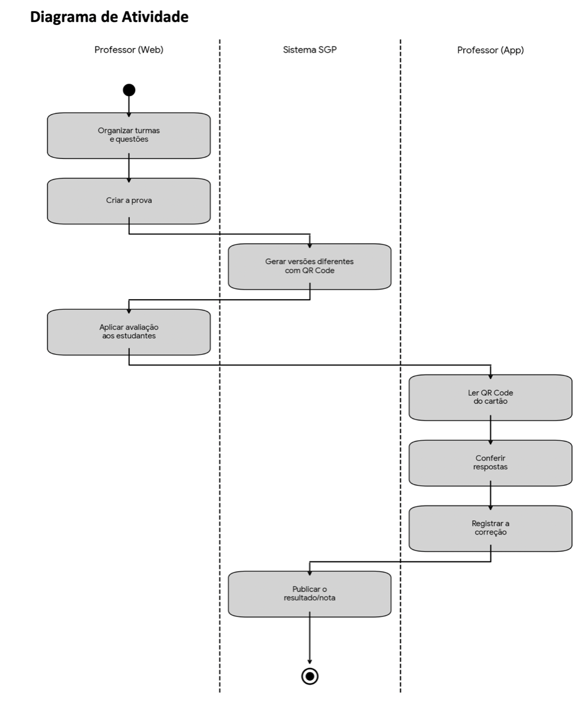
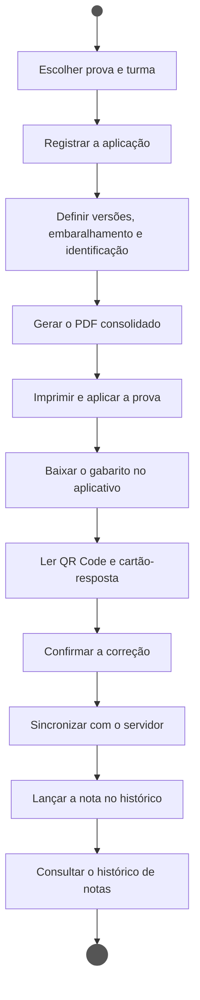
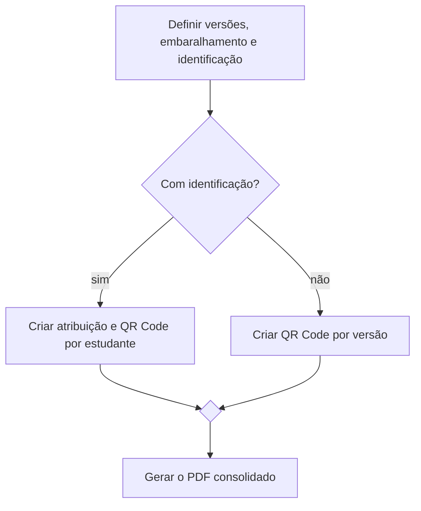
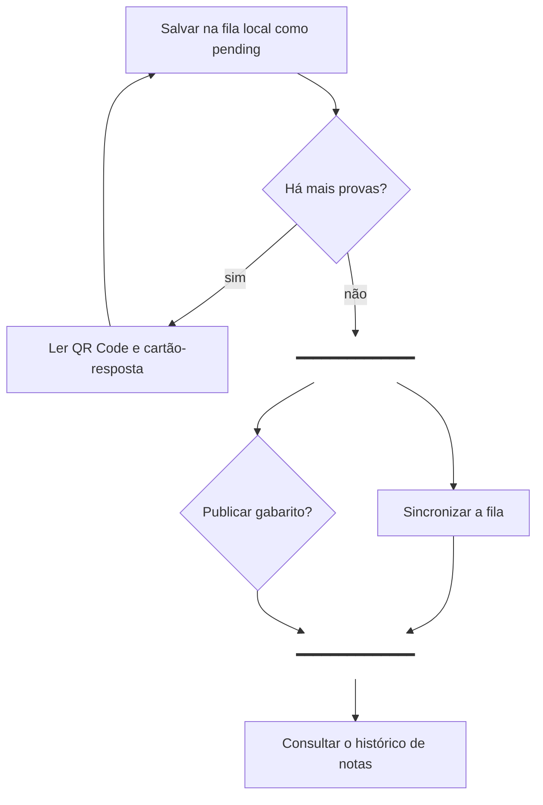
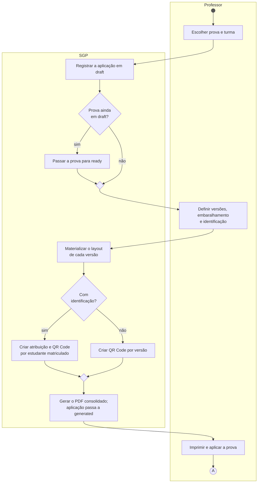
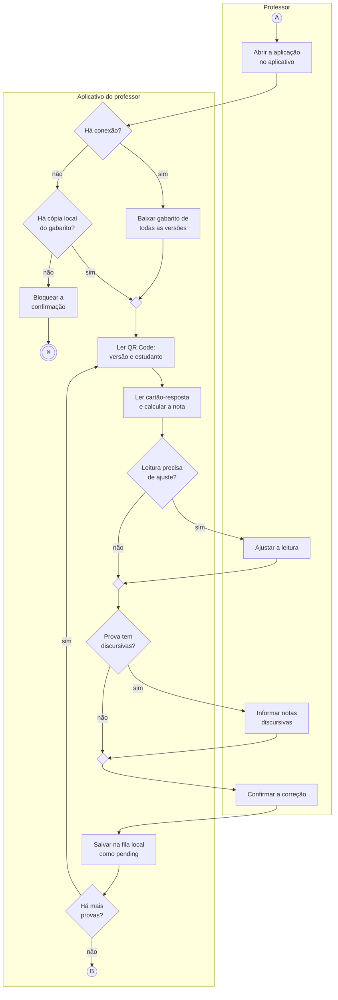
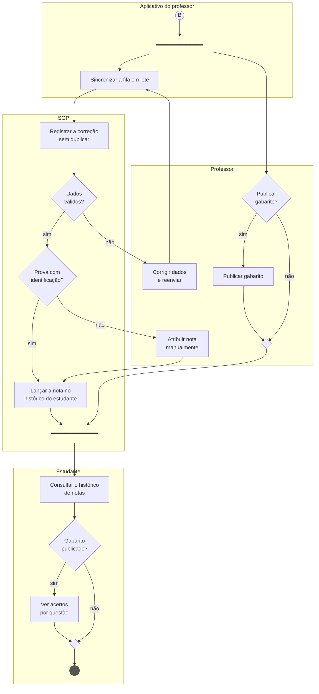

# Diagrama de atividade

O diagrama de atividade mostra **a ordem em que as coisas acontecem** num processo: as
ações, as decisões, o que se repete, o que corre em paralelo e quem é responsável por cada
passo. Enquanto o [diagrama de caso de uso](caso-de-uso.md) diz _o que_ cada ator
consegue fazer, este diz _como_ esses objetivos se encadeiam.

Fontes: [requisitos funcionais](../produto/requisitos-funcionais.md) RF04 a RF11, o
[dicionário de entidades](../modelo-dados/dicionario-de-entidades.md) (estados da prova
e da aplicação) e a versão inicial do diagrama, feita pela equipe no PR #64.

## Passo a passo da construção

### Passo 0 — Ponto de partida: a versão inicial

A primeira versão do diagrama já tinha o essencial. São três raias, Professor (Web),
Sistema SGP e Professor (App), e o caminho principal, de organizar turmas e questões até
publicar a nota. O arquivo original, com o passo a passo do autor, está em
[atividade-versao-inicial.pdf](atividade-versao-inicial.pdf).

Os passos seguintes partem dela e mudam três coisas:

- **Os limites.** Organizar turmas e questões e criar a prova passam a ser pré-condições
  (passo 1). "Publicar o resultado" vira duas ações distintas: lançar a nota no histórico,
  que é automático ou manual (RF09), e publicar o gabarito (RF07).
- **As raias.** Professor (Web) e Professor (App) separavam o mesmo ator pela superfície
  usada. A versão final separa quem decide (Professor) de quem executa, seja no
  dispositivo (Aplicativo do professor) ou no servidor (SGP). Ela também ganha a raia do
  Estudante, porque o processo só termina quando a nota chega a ele (RF11). A pergunta
  que a raia responde está no passo 2.
- **O que o caminho principal não mostra.** Os passos 4 e 5 acrescentam o que os
  requisitos pedem e o desenho linear ainda não tinha: decisões, repetição e paralelismo.

### Passo 1 — Escolher o processo e seus limites

O processo modelado é **aplicar e corrigir uma prova**. A escolha foi pelo processo que
atravessa o sistema inteiro. Ele passa pelos dois atores e pelas duas superfícies (web e
aplicativo) e cobre do RF05 ao RF11.

- **Início**: o professor tem uma prova montada (RF04) e decide aplicá-la a uma turma.
- **Fim**: o estudante consulta a nota no histórico (RF11).
- **Fora**: montar a prova e cadastrar questões e turmas. São pré-condições, não parte
  deste fluxo.

### Passo 2 — Identificar as raias

Cada raia (partição) agrupa as ações de um responsável. Ela responde à pergunta "quem faz
este passo?".

| Raia                    | Responsável por                                                            |
| ----------------------- | -------------------------------------------------------------------------- |
| Professor               | Decisões e ações manuais: configurar, imprimir, ajustar, confirmar         |
| Aplicativo do professor | Leitura do QR Code e do cartão-resposta, fila local e sincronização (RF08) |
| SGP                     | Regras do servidor: estados, geração do PDF, registro das notas            |
| Estudante               | Consulta do resultado (RF11)                                               |

A aplicação web e a API ficam na mesma raia, **SGP**. Para o processo, as duas são o
servidor. A separação entre elas aparece no [diagrama de sequência](sequencia.md).

### Passo 3 — Listar as ações do caminho principal

Primeiro, só o caminho em que tudo dá certo, sem decisões e sem responsáveis. Cada ação é
um verbo no infinitivo. Este rascunho serve para conferir se a ordem faz sentido antes de
complicar.

### Passo 4 — Inserir decisões e junções

Cada requisito foi relido procurando um "se" ou um "quando". Cada um vira um **nó de
decisão** (losango com a pergunta), com as saídas rotuladas. Os caminhos se reencontram
num **nó de junção** (losango vazio).

| Decisão                         | Saídas                                                                  | Fonte |
| ------------------------------- | ----------------------------------------------------------------------- | ----- |
| Prova ainda em draft?           | sim: a prova passa a `ready` na primeira aplicação                      | RF04  |
| Com identificação do estudante? | sim: uma atribuição e um QR Code por estudante; não: QR Code por versão | RF06  |
| Há conexão?                     | sim: baixa o gabarito de todas as versões; não: procura cópia local     | RF08  |
| Há cópia local do gabarito?     | não: a correção não pode ser confirmada e o fluxo termina               | RF08  |
| Leitura precisa de ajuste?      | sim: o professor corrige a leitura antes de confirmar                   | RF08  |
| Prova tem discursivas?          | sim: o professor informa as notas e a nota final é recalculada          | RF08  |
| Dados válidos?                  | não: o item fica com erro, o professor corrige e reenvia                | RF08  |
| Prova com identificação?        | não: a nota fica pendente de atribuição manual                          | RF09  |
| Gabarito publicado?             | sim: o estudante vê os acertos por questão                              | RF11  |

O trecho da geração mostra o padrão de decisão e junção:

A falta de gabarito é diferente das outras decisões, porque um dos lados **encerra o fluxo**
sem chegar ao fim do processo. Para isso existe o **final de fluxo** (círculo com X), que
termina só aquele caminho.

### Passo 5 — Inserir repetição e paralelismo

O professor corrige uma pilha de provas, não uma. O trecho que vai da leitura até salvar
na fila **se repete** enquanto houver provas. A repetição é uma decisão cuja saída "sim"
volta para trás.

Duas coisas acontecem **ao mesmo tempo** depois da correção, sem depender uma da outra:

- o aplicativo sincroniza a fila em segundo plano (RF08);
- o professor decide se publica o gabarito (RF07).

Isso é um **fork** (barra que divide o fluxo) e um **join** (barra que espera os dois
caminhos terminarem). Só depois do join o estudante consulta. Nesse ponto a nota já está
lançada e a publicação do gabarito já foi decidida.

### Passo 6 — Distribuir nas raias e revisar

Por último, cada ação foi colocada na raia do responsável. A revisão confere três pontos:

- todo nó de decisão tem saídas rotuladas e se fecha numa junção ou num final;
- todo fork tem o join correspondente;
- o caminho do início ao fim passa por todas as raias na ordem do processo.

O resultado ficou alto demais para uma página. Por isso foi dividido em três partes,
ligadas pelos **conectores A e B**: preparar e aplicar a prova, corrigir as provas, e
sincronizar e divulgar as notas. O conector é a notação da UML para continuar um fluxo
em outro desenho.

## Diagrama final

### Parte 1 — Preparar e aplicar a prova

### Parte 2 — Corrigir as provas

### Parte 3 — Sincronizar e divulgar as notas

### Como ler a notação

O Mermaid não tem um tipo próprio para diagrama de atividade. O diagrama usa o fluxograma
com estas convenções:

| Elemento UML          | Como aparece aqui                                              |
| --------------------- | -------------------------------------------------------------- |
| Nó inicial            | Círculo preenchido                                             |
| Nó final de atividade | Círculo duplo preenchido                                       |
| Final de fluxo        | Círculo duplo com ✕: termina só aquele caminho                 |
| Ação                  | Retângulo com verbo no infinitivo                              |
| Decisão               | Losango com a pergunta; saídas rotuladas sim e não             |
| Junção (merge)        | Losango vazio                                                  |
| Fork e join           | Barra horizontal                                               |
| Partição (raia)       | Retângulo com o nome do responsável                            |
| Conector              | Círculo com letra: o fluxo continua no conector de mesma letra |

## O que o diagrama deixa de fora

- **Regerar o PDF** (RF06) só é permitido sem correção confirmada. É um fluxo alternativo
  do professor e não faz parte do caminho de aplicar e corrigir.
- **Conflito de correções** (RF08): com duas correções para o mesmo estudante e a mesma
  versão, o servidor mantém a primeira e sinaliza para revisão. Fica dentro da ação
  "Registrar a correção sem duplicar" e aparece em detalhe no
  [diagrama de sequência](sequencia.md).
- Na N1, o QR Code, a câmera e a fila são **simulados** com dados estáticos. O diagrama
  descreve o comportamento da especificação, que é o alvo da implementação.

## Rastreabilidade

| RF   | Onde aparece                                                                         |
| ---- | ------------------------------------------------------------------------------------ |
| RF04 | Decisão "Prova ainda em draft?" e transição para `ready`                             |
| RF05 | Escolher prova e turma; registrar a aplicação em draft                               |
| RF06 | Versões, layout, atribuições por estudante, PDF consolidado                          |
| RF07 | Fork: publicar gabarito                                                              |
| RF08 | Gabarito offline, leitura, ajuste, discursivas, fila local, sincronização, validação |
| RF09 | Atribuir nota manualmente quando a prova não tem identificação                       |
| RF11 | Consultar o histórico; ver acertos só com gabarito publicado                         |
