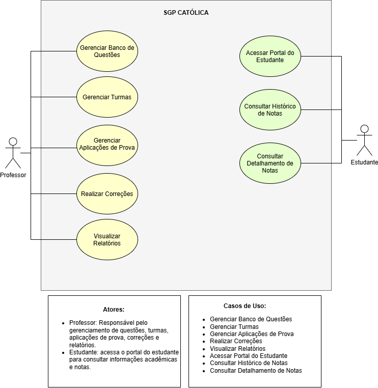
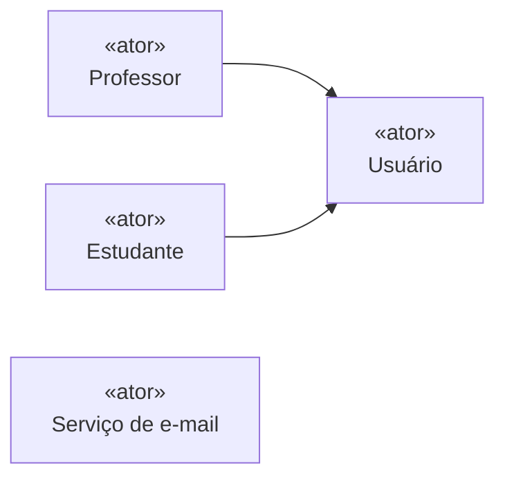
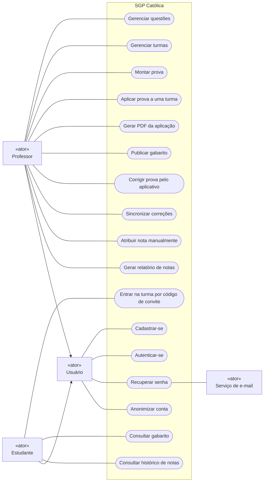
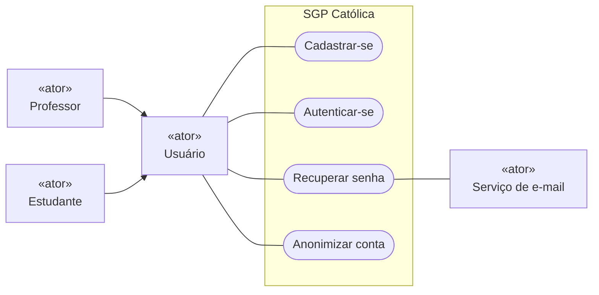
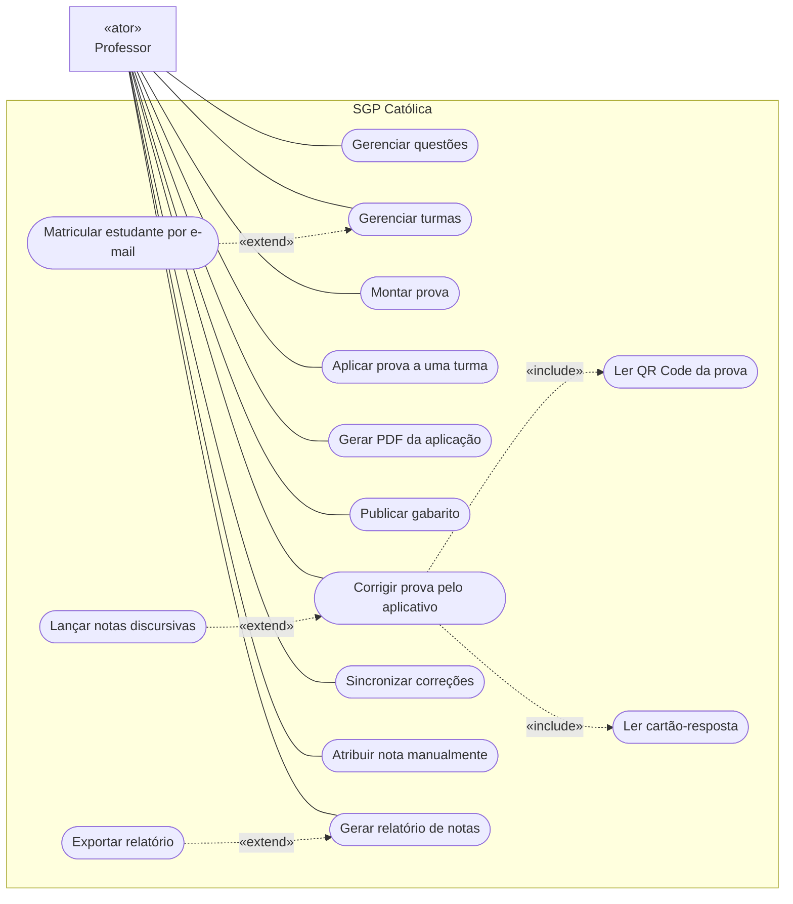
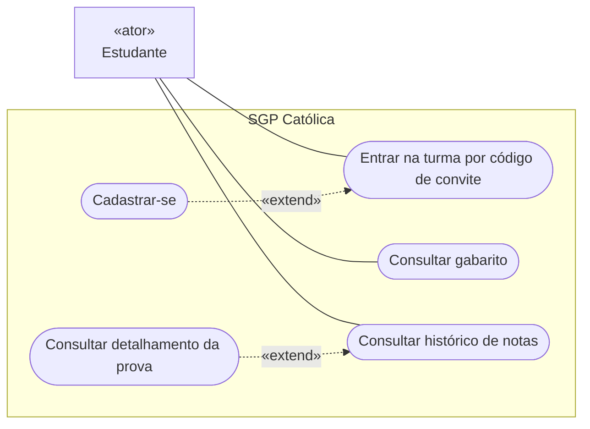

# Diagrama de caso de uso

O diagrama de caso de uso mostra **quem usa o SGP Católica e para quê**: os atores, os
objetivos que cada um atinge com o sistema e como esses objetivos se relacionam. Ele não
mostra telas nem ordem de execução. A ordem fica no [diagrama de atividade](atividade.md)
e a troca de mensagens no [diagrama de sequência](sequencia.md).

Fontes: [requisitos funcionais](../produto/requisitos-funcionais.md) (RF01 a RF11) e a
versão inicial do diagrama, feita pela equipe no PR #54.

## Passo a passo da construção

### Passo 0 — Ponto de partida: a versão inicial

A primeira versão do diagrama foi desenhada a partir das telas da N1. Ela tem dois atores
(Professor e Estudante) e oito casos de uso:

Essa versão é o ponto de partida. Os passos seguintes refazem o caminho a partir dos
requisitos, e não das telas. Uma tela mostra o que já está construído. O requisito mostra
o que o sistema precisa permitir. O confronto entre os dois está no
[passo 6](#passo-6--revisar-contra-os-requisitos).

### Passo 1 — Delimitar o sistema

A fronteira do sistema separa o que o SGP faz do que fica fora dele.

- **Dentro**: a aplicação web (professor e estudante) e o aplicativo do professor. Os dois
  são o mesmo sistema do ponto de vista de quem usa, porque compartilham contas, provas e
  notas.
- **Fora**: o envio de e-mail (recuperação de senha, RF01) e a impressão da prova, que o
  professor faz com o PDF gerado.

No diagrama, a fronteira é o retângulo **SGP Católica**. Atores ficam do lado de fora.

### Passo 2 — Identificar os atores

Ator é um papel que interage com o sistema, não uma pessoa específica. As perguntas usadas
foram: quem inicia uma ação no sistema? Quem recebe algo dele? Que sistema externo ele
aciona?

| Ator              | Tipo       | Por que é ator                                                                      |
| ----------------- | ---------- | ----------------------------------------------------------------------------------- |
| Professor         | primário   | Monta provas, aplica, corrige e acompanha notas (RF02 a RF10)                       |
| Estudante         | primário   | Entra em turmas e consulta notas e gabaritos (RF03, RF07, RF11)                     |
| Usuário           | abstrato   | O que professor e estudante fazem igual: cadastro, login e conta (RF01 e RF01.1)    |
| Serviço de e-mail | secundário | Sistema externo acionado pelo SGP para enviar o link de recuperação de senha (RF01) |

**Usuário** aparece por causa de uma repetição. Sem ele, os quatro casos de uso de conta
seriam ligados duas vezes, uma ao Professor e outra ao Estudante. Professor e Estudante
**especializam** Usuário: herdam as associações dele e acrescentam as suas.

### Passo 3 — Levantar os casos de uso a partir dos requisitos

Caso de uso é um **objetivo** do ator, nomeado com verbo no infinitivo e complemento. Cada
requisito foi lido com a pergunta: "o que o ator quer conseguir aqui?".

| RF     | Caso de uso                           | Ator      |
| ------ | ------------------------------------- | --------- |
| RF01   | Cadastrar-se                          | Usuário   |
| RF01   | Autenticar-se                         | Usuário   |
| RF01   | Recuperar senha                       | Usuário   |
| RF01.1 | Anonimizar conta                      | Usuário   |
| RF02   | Gerenciar questões                    | Professor |
| RF03   | Gerenciar turmas                      | Professor |
| RF03   | Entrar na turma por código de convite | Estudante |
| RF04   | Montar prova                          | Professor |
| RF05   | Aplicar prova a uma turma             | Professor |
| RF06   | Gerar PDF da aplicação                | Professor |
| RF07   | Publicar gabarito                     | Professor |
| RF07   | Consultar gabarito                    | Estudante |
| RF08   | Corrigir prova pelo aplicativo        | Professor |
| RF08   | Sincronizar correções                 | Professor |
| RF09   | Atribuir nota manualmente             | Professor |
| RF10   | Gerar relatório de notas              | Professor |
| RF11   | Consultar histórico de notas          | Estudante |

Três critérios guiaram o recorte:

- **Gerenciar** agrupa as operações de cadastro de uma mesma coisa (criar, editar, listar,
  excluir). Questões e turmas têm um caso de uso cada, e não quatro.
- **Navegar não é objetivo.** "Acessar portal do estudante" é o caminho até as consultas.
  O estudante quer consultar notas e gabaritos, então esses são os casos de uso.
- **Sincronizar correções** é ação do professor porque ele pode reenviar manualmente um
  item com erro (RF08). Ao reconectar, o aplicativo também sincroniza sozinho.

### Passo 4 — Associar atores e casos de uso

Cada caso de uso fica dentro da fronteira e é ligado por uma linha ao ator que o inicia.
O Serviço de e-mail fica à direita, ligado ao único caso de uso que o aciona.

### Passo 5 — Estruturar com «include» e «extend»

Com os objetivos ligados, cada caso de uso foi examinado em busca de comportamento que
**sempre** acontece dentro dele, ou que **às vezes** acontece.

- **«include»**: o caso de uso base sempre executa o incluído. A seta vai do base para o
  incluído.
- **«extend»**: o caso de uso que estende só acontece sob uma condição, num ponto do base.
  A seta vai de quem estende para o base.

| Relação                                                        | Tipo      | Condição ou motivo                                                    |
| -------------------------------------------------------------- | --------- | --------------------------------------------------------------------- |
| Corrigir prova pelo aplicativo → Ler QR Code da prova          | «include» | Toda correção começa identificando versão e aluno pelo QR Code (RF08) |
| Corrigir prova pelo aplicativo → Ler cartão-resposta           | «include» | Toda correção lê as marcações e confronta com o gabarito (RF08)       |
| Lançar notas discursivas → Corrigir prova pelo aplicativo      | «extend»  | Só quando a prova tem questões discursivas (RF08)                     |
| Matricular estudante por e-mail → Gerenciar turmas             | «extend»  | O professor pode matricular quem já tem conta (RF03)                  |
| Cadastrar-se → Entrar na turma por código de convite           | «extend»  | Só quando o e-mail ainda não tem conta: cadastro e matrícula juntos   |
| Exportar relatório → Gerar relatório de notas                  | «extend»  | Exportação opcional em CSV, Excel ou PDF (RF10)                       |
| Consultar detalhamento da prova → Consultar histórico de notas | «extend»  | Só com o gabarito publicado (RF11 e RF07)                             |

Uma decisão ficou de fora de propósito: **Autenticar-se não é incluído** em todos os
casos de uso que exigem login. Estar autenticado é **pré-condição**, não um passo do
objetivo. Ligar Autenticar-se a tudo com «include» enche o diagrama de setas sem dizer
nada novo.

### Passo 6 — Revisar contra os requisitos

A revisão confere duas coisas. Primeiro, se todo RF tem pelo menos um caso de uso. Depois,
se todo caso de uso vem de algum RF. A tabela de [rastreabilidade](#rastreabilidade)
mostra o resultado. Em relação à versão inicial do passo 0:

| Versão inicial                  | Versão final                                                                      | Motivo                                                       |
| ------------------------------- | --------------------------------------------------------------------------------- | ------------------------------------------------------------ |
| Gerenciar Banco de Questões     | Gerenciar questões                                                                | Mesmo objetivo (RF02)                                        |
| Gerenciar Turmas                | Gerenciar turmas, estendido por Matricular estudante por e-mail                   | RF03 separa a matrícula feita pelo professor                 |
| Gerenciar Aplicações de Prova   | Aplicar prova a uma turma e Gerar PDF da aplicação                                | RF05 e RF06 são objetivos distintos; o PDF pode ser regerado |
| Realizar Correções              | Corrigir prova pelo aplicativo, Sincronizar correções e Atribuir nota manualmente | RF08 e RF09 têm atores, superfícies e condições diferentes   |
| Visualizar Relatórios           | Gerar relatório de notas, estendido por Exportar relatório                        | RF10 pede exportação                                         |
| Acessar Portal do Estudante     | (removido)                                                                        | Navegação, não objetivo (passo 3)                            |
| Consultar Histórico de Notas    | Consultar histórico de notas                                                      | Mesmo objetivo (RF11)                                        |
| Consultar Detalhamento de Notas | Consultar detalhamento da prova, como «extend»                                    | Depende do gabarito publicado (RF11)                         |
| —                               | Cadastrar-se, Autenticar-se, Recuperar senha, Anonimizar conta                    | RF01 e RF01.1 não estavam cobertos                           |
| —                               | Montar prova                                                                      | RF04 não estava coberto                                      |
| —                               | Publicar gabarito e Consultar gabarito                                            | RF07 não estava coberto                                      |
| —                               | Entrar na turma por código de convite                                             | Matrícula feita pelo próprio estudante (RF03)                |

## Diagrama final

Com 23 casos de uso, um único desenho fica ilegível: as linhas de associação se cruzam
dentro da fronteira. O modelo final é **um só**, apresentado em três visões que dividem os
casos de uso por assunto. É a prática da UML para sistemas desse tamanho. Um caso de uso
pode aparecer em mais de uma visão quando participa de uma relação que atravessa as duas,
como Cadastrar-se.

### Visão 1 — Conta e acesso

### Visão 2 — Professor

### Visão 3 — Estudante

### Como ler a notação

O Mermaid, usado para que o GitHub renderize o diagrama, não tem um tipo próprio para caso
de uso. O diagrama usa o fluxograma com estas convenções:

| Elemento UML       | Como aparece aqui                                              |
| ------------------ | -------------------------------------------------------------- |
| Ator               | Retângulo com o estereótipo «ator», notação alternativa da UML |
| Caso de uso        | Forma arredondada (no lugar da elipse)                         |
| Fronteira          | Retângulo **SGP Católica**                                     |
| Associação         | Linha contínua sem seta                                        |
| Generalização      | Seta contínua do ator especializado para o geral               |
| «include»/«extend» | Seta tracejada com o estereótipo no rótulo                     |

## Rastreabilidade

| RF     | Casos de uso                                                                                                               |
| ------ | -------------------------------------------------------------------------------------------------------------------------- |
| RF01   | Cadastrar-se, Autenticar-se, Recuperar senha                                                                               |
| RF01.1 | Anonimizar conta                                                                                                           |
| RF02   | Gerenciar questões                                                                                                         |
| RF03   | Gerenciar turmas, Matricular estudante por e-mail, Entrar na turma por código de convite                                   |
| RF04   | Montar prova                                                                                                               |
| RF05   | Aplicar prova a uma turma                                                                                                  |
| RF06   | Gerar PDF da aplicação                                                                                                     |
| RF07   | Publicar gabarito, Consultar gabarito                                                                                      |
| RF08   | Corrigir prova pelo aplicativo, Ler QR Code da prova, Ler cartão-resposta, Lançar notas discursivas, Sincronizar correções |
| RF09   | Atribuir nota manualmente                                                                                                  |
| RF10   | Gerar relatório de notas, Exportar relatório                                                                               |
| RF11   | Consultar histórico de notas, Consultar detalhamento da prova                                                              |
