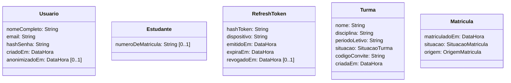
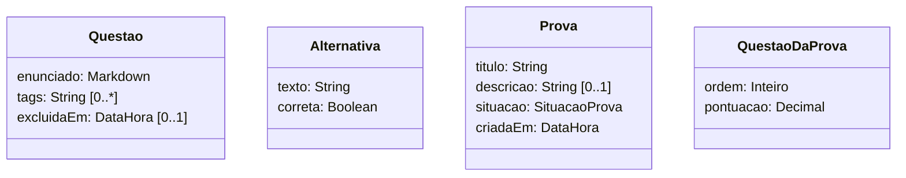
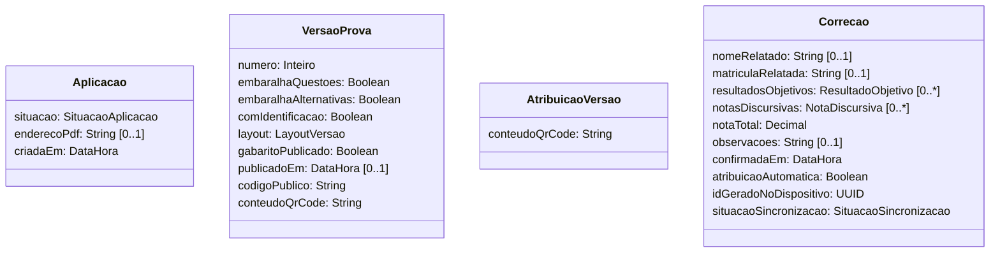
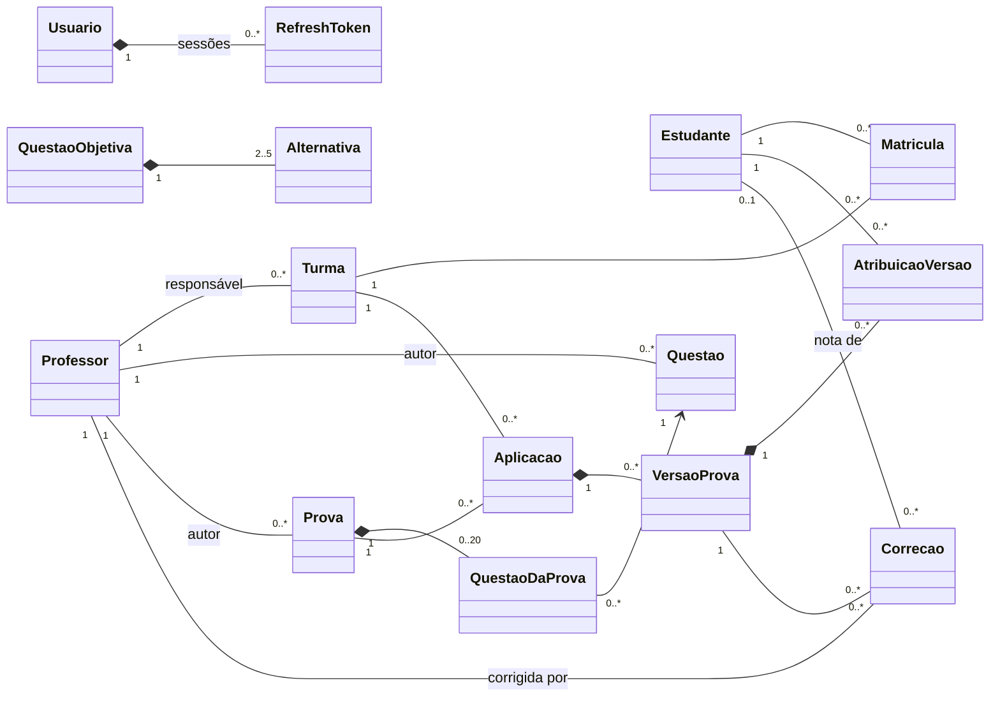
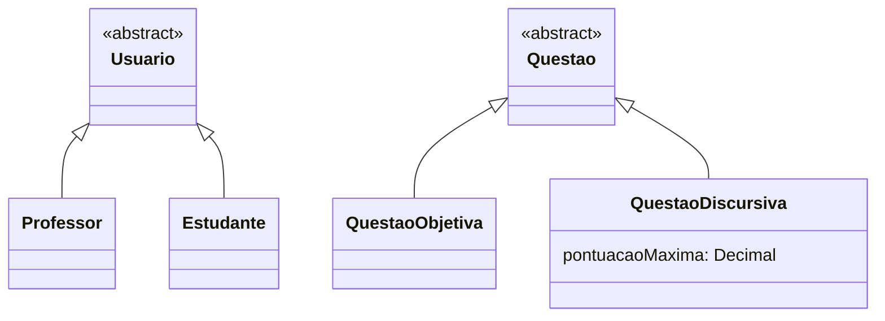
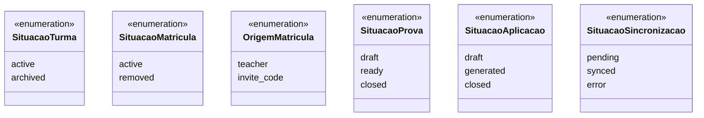
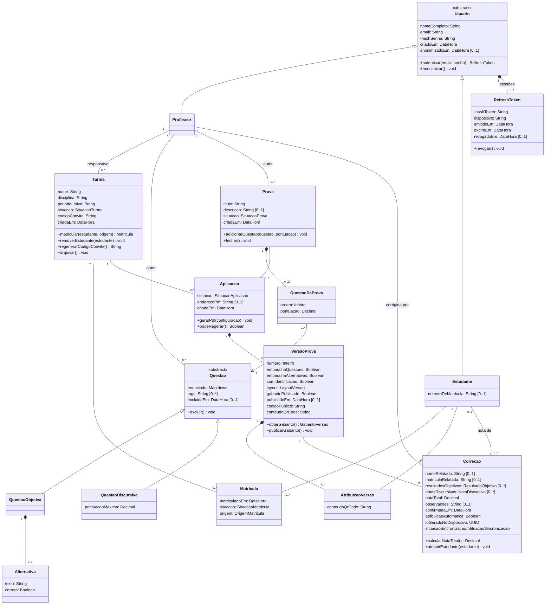

# Diagrama de classe

O diagrama de classe mostra **a estrutura do domínio**: quais conceitos o sistema guarda,
o que cada um sabe (atributos), o que cada um faz (operações) e como eles se ligam
(associações, com multiplicidade). É o modelo do qual saem as tabelas e os tipos quando o
backend for construído.

Fontes: [dicionário de entidades](../modelo-dados/dicionario-de-entidades.md),
[requisitos funcionais](../produto/requisitos-funcionais.md) e os tipos de
`packages/shared-types`, que já representam parte deste modelo na N1.

## Passo a passo da construção

### Passo 1 — Levantar classes candidatas

Os requisitos foram lidos sublinhando os **substantivos**. Cada um virou candidato:

> professor, estudante, usuário, conta, sessão, turma, matrícula, código de convite,
> questão, alternativa, tag, prova, pontuação, aplicação, versão, embaralhamento, PDF,
> QR Code, gabarito, atribuição, cartão-resposta, correção, nota, fila, relatório,
> histórico

Depois, cada candidato passou por um filtro: ele tem **identidade e ciclo de vida
próprios**, ou é só uma característica de outro conceito?

| Candidato                                   | Decisão                   | Por quê                                                                         |
| ------------------------------------------- | ------------------------- | ------------------------------------------------------------------------------- |
| professor, estudante, usuário               | classes                   | Têm identidade e dados próprios. Usuário generaliza os outros dois              |
| sessão                                      | classe `RefreshToken`     | Uma por dispositivo, revogável individualmente (RF01)                           |
| turma, matrícula                            | classes                   | A matrícula tem data, situação e origem próprias (RF03)                         |
| questão, alternativa                        | classes                   | A alternativa pertence a uma questão objetiva                                   |
| prova                                       | classe                    | Conteúdo reutilizável, com situação própria (RF04)                              |
| pontuação na prova                          | classe `QuestaoDaProva`   | A pontuação e a ordem pertencem ao par prova-questão, não a um dos dois         |
| aplicação, versão, atribuição               | classes                   | Cada uma tem identidade e regras próprias (RF05 e RF06)                         |
| correção                                    | classe                    | É onde a nota mora (RF08 e RF09)                                                |
| conta, código de convite, tag, PDF, QR Code | atributos                 | Não existem sozinhos: são dados de usuário, turma, questão, aplicação ou versão |
| embaralhamento, nota                        | atributos                 | Indicadores da versão e total da correção                                       |
| gabarito                                    | derivado                  | Sai das questões da prova mais o layout da versão                               |
| relatório, histórico                        | derivados                 | São consultas sobre as correções, não dados guardados (RF10 e RF11)             |
| cartão-resposta, fila                       | fora do modelo de domínio | O cartão é papel; a fila é um detalhe do aplicativo (RF08)                      |

### Passo 2 — Definir os atributos

Cada classe recebeu os atributos que o dicionário de entidades descreve, com tipo e
opcionalidade. `[0..1]` marca o atributo que pode ficar vazio.

Duas convenções:

- **Sem identificadores nem chaves estrangeiras.** A referência de uma classe a outra é a
  associação desenhada no passo 3. Repetir `turmaId` como atributo diria a mesma coisa
  duas vezes.
- **Nomes no idioma do domínio.** Nos tipos de `packages/shared-types`, os campos seguem os
  nomes da especificação em inglês (`nomeCompleto` corresponde a `fullName`).

As classes aparecem em três grupos, um por assunto, para o desenho continuar legível.

**Conta e turmas**

**Questões e provas**

**Aplicação e correção**

`LayoutVersao`, `ResultadoObjetivo` e `NotaDiscursiva` são **tipos de valor**. Não têm
identidade própria e só existem dentro do objeto que os contém. Por isso aparecem como
tipo de atributo, e não como classes ligadas por associação.

### Passo 3 — Ligar as classes e definir a multiplicidade

Para cada par de classes que se relacionam, duas perguntas, uma em cada sentido: "um X se
liga a quantos Y?" e "um Y se liga a quantos X?". As respostas viram a multiplicidade
nas pontas da linha.

Três tipos de relação foram usados:

- **Associação** (linha simples): as duas classes existem de forma independente.
- **Composição** (losango cheio): a parte não existe sem o todo e some com ele. Exemplo: a
  versão de uma aplicação. Regerar o PDF substitui as versões (RF06).
- **Classe de associação**: `Matricula` e `QuestaoDaProva` guardam dados do vínculo entre
  duas classes. Aparecem aqui como classe intermediária ligada às duas pontas.

Alguns valores merecem explicação:

| Ligação                        | Multiplicidade | Regra                                                                           |
| ------------------------------ | -------------- | ------------------------------------------------------------------------------- |
| Prova → QuestaoDaProva         | 0..20          | Até 20 questões por prova (RF04)                                                |
| QuestaoObjetiva → Alternativa  | 2..5           | De 2 a 5 alternativas (RF02)                                                    |
| Aplicacao → VersaoProva        | 0..\*          | A aplicação nasce em `draft`, sem versões; a geração cria uma ou mais (RF06)    |
| Correcao → Estudante           | 0..1           | Sem identificação, a correção fica sem estudante até a atribuição manual (RF09) |
| VersaoProva → AtribuicaoVersao | 0..\*          | Só existe atribuição quando a versão é gerada com identificação (RF06)          |

O dicionário também liga a aplicação ao professor. A ligação não foi desenhada porque é
**derivada**: prova e turma já pertencem ao professor.

### Passo 4 — Generalizar

Duas hierarquias apareceram ao comparar os atributos:

- **Professor e Estudante** têm os mesmos dados de conta e o mesmo login. O que é comum
  sobe para `Usuario`, uma classe abstrata: não existe usuário que não seja um dos dois. O
  papel (`professor` ou `estudante`) passa a ser dado pela própria subclasse.
- **Questão objetiva e discursiva** compartilham enunciado e tags, mas só a objetiva tem
  alternativas, e só a discursiva tem pontuação máxima. A generalização deixa cada regra
  na classe a que pertence.

Nos tipos da N1, a questão é uma interface única com o campo `type`, e não duas
subclasses. As duas formas representam o mesmo modelo. A generalização deixa mais visível
qual atributo vale para qual tipo.

### Passo 5 — Atribuir as operações

As operações saem dos casos de uso: cada objetivo do ator precisa de alguém no modelo que
o execute. A regra foi colocar a operação na classe que **tem os dados** para executá-la.

| Classe       | Operação                                                                                                 | Origem                                              |
| ------------ | -------------------------------------------------------------------------------------------------------- | --------------------------------------------------- |
| Usuario      | `autenticar(email, senha)`, `anonimizar()`                                                               | RF01, RF01.1                                        |
| RefreshToken | `revogar()`                                                                                              | RF01: logout de um ou de todos os dispositivos      |
| Turma        | `matricular(estudante, origem)`, `removerEstudante(estudante)`, `regenerarCodigoConvite()`, `arquivar()` | RF03                                                |
| Questao      | `excluir()`                                                                                              | RF02: exclusão lógica                               |
| Prova        | `adicionarQuestao(questao, pontuacao)`, `fechar()`                                                       | RF04                                                |
| Aplicacao    | `gerarPdf(configuracao)`, `podeRegerar()`                                                                | RF06: só regera sem correção confirmada             |
| VersaoProva  | `obterGabarito()`, `publicarGabarito()`                                                                  | RF08: o aplicativo baixa o gabarito da versão; RF07 |
| Correcao     | `calcularNotaTotal()`, `atribuirEstudante(estudante)`                                                    | RF08, RF09: atribuir preenche a correção existente  |

`GabaritoVersao`, o retorno de `obterGabarito()`, é outro tipo de valor: a cópia do gabarito
que o aplicativo guarda para corrigir sem conexão. No código, corresponde a
`GabaritoVersaoSnapshot`.

### Passo 6 — Separar as enumerações

Os atributos de situação aceitam um conjunto fechado de valores. Esses valores vão para
**enumerações**, para que o modelo não aceite um valor inválido. Os valores seguem a
especificação, em inglês, como nos tipos do código.

## Diagrama final

As enumerações do passo 6 completam o modelo. Ficam fora do desenho final para não
cruzar linhas com as classes que as usam como tipo de atributo.

### Como ler a notação

| Elemento                    | Significado                                                                |
| --------------------------- | -------------------------------------------------------------------------- |
| `«abstract»`                | Classe sem instâncias diretas, só por meio das subclasses                  |
| Seta com triângulo vazado   | Generalização: a subclasse herda atributos, operações e associações        |
| Losango cheio               | Composição: a parte não existe sem o todo                                  |
| Linha simples               | Associação                                                                 |
| Seta aberta                 | Associação navegável num só sentido (`QuestaoDaProva` conhece a `Questao`) |
| `1`, `0..1`, `0..*`, `2..5` | Multiplicidade em cada ponta da ligação                                    |
| `+` e `-`                   | Operação pública e atributo privado (o hash não sai da classe)             |
| `[0..1]`                    | Atributo opcional                                                          |

## Correspondência com o código

| Classe                | Tipo em `packages/shared-types`                           |
| --------------------- | --------------------------------------------------------- |
| Usuario               | `Usuario`, com `role` no lugar da generalização           |
| Professor             | `Professor`                                               |
| Estudante             | `Estudante`                                               |
| RefreshToken          | ainda sem tipo: a autenticação real não faz parte da N1   |
| Turma, Matricula      | `Turma`, `Matricula`                                      |
| Questao e subclasses  | `Questao`, com `type` no lugar da generalização           |
| Alternativa           | `Alternativa`; a correta é `Questao.correctAlternativeId` |
| Prova, QuestaoDaProva | `Prova`, `QuestaoDaProva`                                 |
| Aplicacao             | `Aplicacao`                                               |
| VersaoProva           | `VersaoProva`                                             |
| AtribuicaoVersao      | `AtribuicaoVersao`                                        |
| Correcao              | `Correcao`                                                |

## Pontos em aberto

O diagrama não resolve as pendências registradas em [pendências](../pendencias.md):

- **Item 16**: se `QuestaoDaProva.pontuacao` pode divergir de
  `QuestaoDiscursiva.pontuacaoMaxima`, e qual prevalece. O modelo guarda os dois valores
  separados, sem regra entre eles.
- **Item 17**: se `VersaoProva.layout` grava a ordem das alternativas também quando
  `embaralhaAlternativas` é falso.
