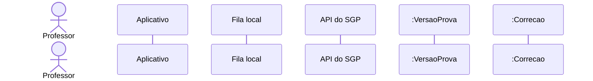
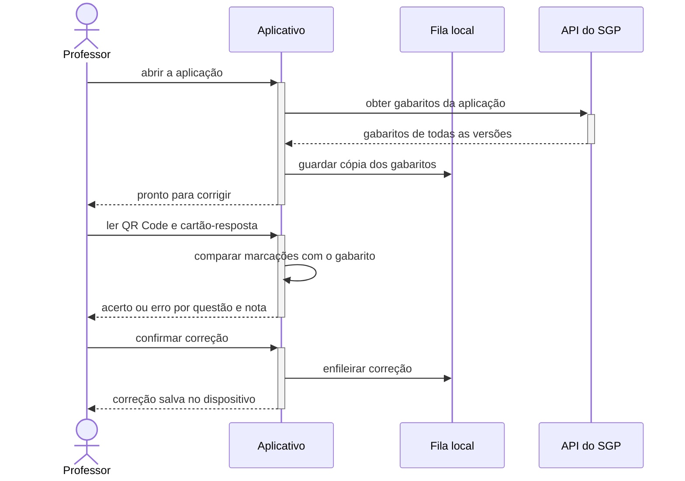
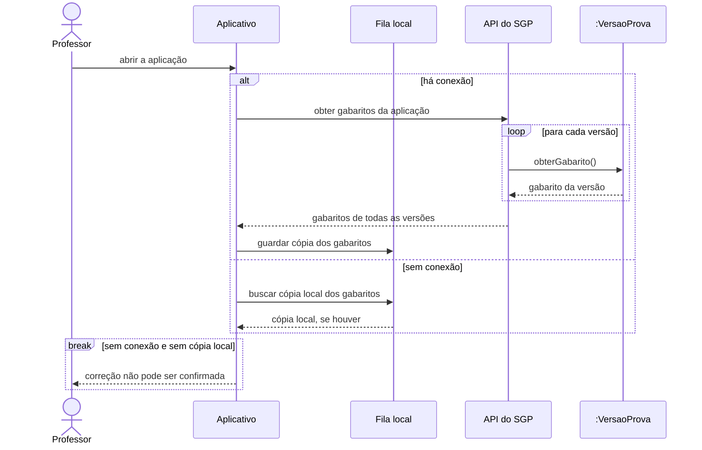
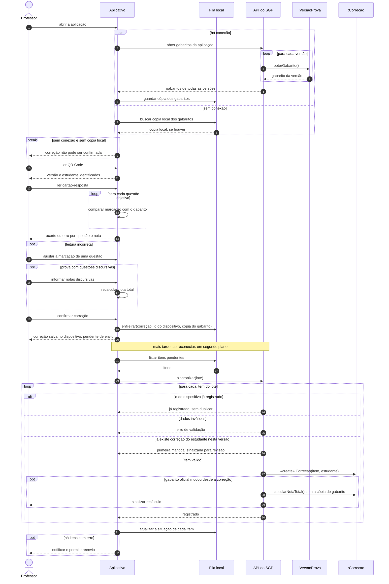

# Diagrama de sequência

O diagrama de sequência mostra **quem fala com quem, e em que ordem**, para realizar um
cenário. Cada participante é uma linha de vida vertical, e cada mensagem é uma seta
horizontal. O tempo corre de cima para baixo. É o diagrama que liga os outros três: o
cenário vem de um caso de uso, a ordem confere com o diagrama de atividade e as mensagens
para os objetos do domínio são operações do diagrama de classe.

Fontes: [requisitos funcionais](../produto/requisitos-funcionais.md) RF08 e os
diagramas de [caso de uso](caso-de-uso.md), [atividade](atividade.md) e
[classe](classe.md).

## Passo a passo da construção

### Passo 1 — Escolher o cenário

Um diagrama de sequência descreve **um cenário de um caso de uso**, não o sistema
inteiro. O escolhido foi **Corrigir prova pelo aplicativo** (RF08) para uma prova gerada
com identificação do estudante, seguido da sincronização.

O motivo é que esse é o cenário com mais interação entre partes. Ele tem leitura no
dispositivo, funcionamento sem conexão, fila local e um servidor que precisa aceitar o
mesmo envio duas vezes sem duplicar a nota. Num cenário com tantas partes, a ordem das
mensagens importa e o diagrama ajuda a enxergá-la.

### Passo 2 — Identificar os participantes

Os participantes saem dos outros diagramas: o ator vem do caso de uso, as partes do
sistema vêm das raias da atividade e os objetos vêm do diagrama de classe.

| Participante | Tipo                  | Papel no cenário                                          |
| ------------ | --------------------- | --------------------------------------------------------- |
| Professor    | ator                  | Lê a prova com a câmera, ajusta, informa notas e confirma |
| Aplicativo   | sistema (dispositivo) | Lê QR Code e cartão-resposta e calcula a nota sem conexão |
| Fila local   | armazenamento local   | Guarda correções e cópias do gabarito no dispositivo      |
| API do SGP   | sistema (servidor)    | Entrega gabaritos e registra correções                    |
| :VersaoProva | objeto do domínio     | Fornece o gabarito de uma versão                          |
| :Correcao    | objeto do domínio     | A nota registrada no servidor                             |

A **API do SGP** é um participante lógico. A tecnologia do backend ainda está em aberto
(item 3 das [pendências](../pendencias.md)), e o diagrama não depende dela.

### Passo 3 — Desenhar o caminho principal

Primeiro, só o caminho em que tudo dá certo, sem condições. A seta cheia é uma chamada e a
tracejada é a resposta. A barra sobre a linha de vida (ativação) mostra quando o
participante está trabalhando.

### Passo 4 — Acrescentar os fragmentos combinados

Cada condição do RF08 virou um **fragmento combinado**: um retângulo com um operador que
diz como as mensagens dentro dele se comportam.

| Operador | Uso no cenário                                                                       |
| -------- | ------------------------------------------------------------------------------------ |
| `alt`    | Com conexão, baixa os gabaritos; sem conexão, usa a cópia local                      |
| `break`  | Sem conexão e sem cópia local, o cenário termina: a correção não pode ser confirmada |
| `loop`   | Comparação repetida para cada questão objetiva; o gabarito de cada versão            |
| `opt`    | Ajuste manual da leitura; notas discursivas, só quando a prova as tem                |

O trecho da abertura mostra `alt`, `loop` e `break` juntos:

### Passo 5 — Modelar a sincronização

A correção termina no dispositivo. O envio ao servidor acontece **depois**, quando há
conexão, e pode levar minutos ou dias. Por isso a sincronização aparece como uma segunda
etapa, separada por uma nota. Três regras do RF08 definem as respostas do servidor:

- **Idempotência**: cada item carrega o identificador gerado no dispositivo. Se ele já foi
  registrado, o servidor responde sem criar outro registro.
- **Gabarito alterado**: se o gabarito oficial mudou depois da correção, o servidor
  recalcula a nota com a cópia que foi enviada junto e sinaliza o professor.
- **Correção repetida**: se já existe correção do mesmo estudante na mesma versão, o
  servidor mantém a primeira e sinaliza para revisão. Ele nunca sobrescreve em silêncio.

A mensagem `«create»` indica que a API cria o objeto `:Correcao`.

### Passo 6 — Conferir com os outros diagramas

A revisão final conferiu três pontos:

- **Classe**: as mensagens para objetos do domínio existem como operações.
  `obterGabarito()` está em `VersaoProva` e `calcularNotaTotal()` está em `Correcao`.
- **Atividade**: a ordem das mensagens bate com as partes 2 e 3 do
  [diagrama de atividade](atividade.md). Primeiro o gabarito, depois a leitura, os
  ajustes, a confirmação e a fila, e por fim a sincronização.
- **Caso de uso**: os «include» de Corrigir prova (Ler QR Code e Ler cartão-resposta)
  aparecem como mensagens, e o «extend» de notas discursivas aparece como `opt`.

## Diagrama final

### Como ler a notação

| Elemento           | Significado                                               |
| ------------------ | --------------------------------------------------------- |
| Linha de vida      | Participante; o tempo corre de cima para baixo            |
| Seta cheia         | Mensagem: chamada ou ação                                 |
| Seta tracejada     | Resposta                                                  |
| Seta para si mesmo | Processamento interno do participante                     |
| `alt` / `else`     | Alternativas mutuamente exclusivas                        |
| `opt`              | Trecho executado só se a condição valer                   |
| `loop`             | Trecho repetido                                           |
| `break`            | Se a condição valer, o trecho executa e o cenário termina |
| `«create»`         | Mensagem que cria o objeto                                |
| Números            | Ordem das mensagens, para citar um passo                  |

## Pontos em aberto

- A especificação não diz **qual situação** o item da fila assume quando o servidor
  mantém a primeira correção e sinaliza a segunda para revisão: `synced`, `error` ou outra.
  Por isso o diagrama diz só "atualizar a situação de cada item".
- Na N1, a leitura de QR Code, a câmera e a fila são **simuladas** com dados estáticos. O
  diagrama descreve o comportamento da especificação, que é o alvo da implementação.
